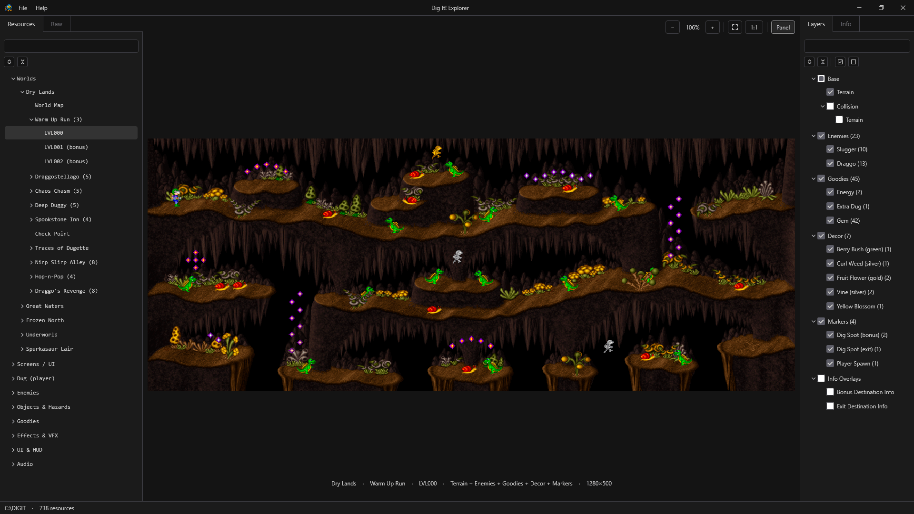
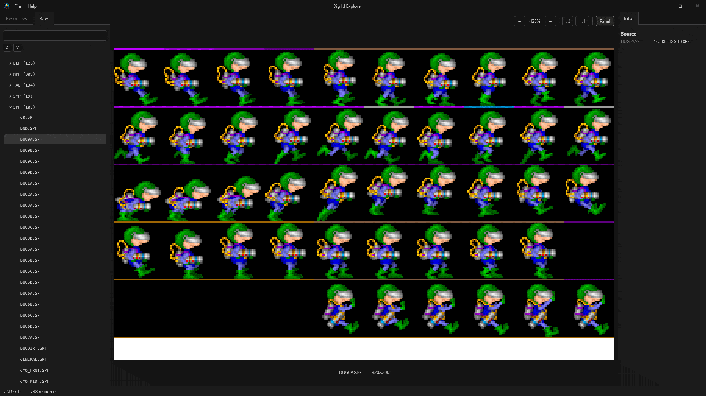
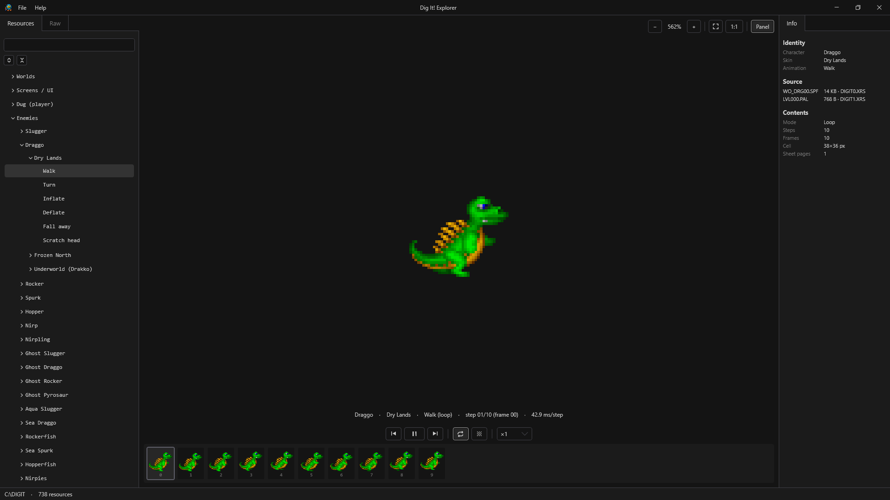
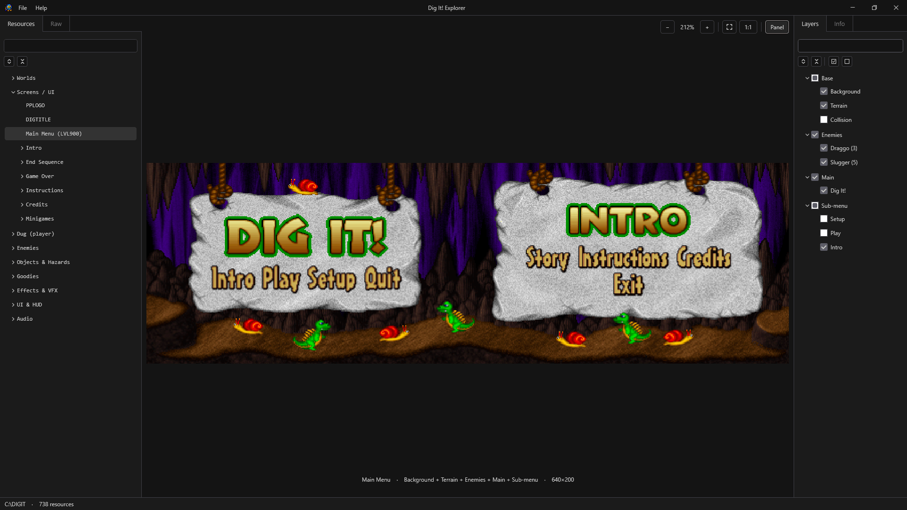

<div align="center">

# Dig It! Explorer

**Browses and reconstructs Dig It! levels, animations, screens, and audio from a local copy with no emulator.**

[](#changelog)
[](LICENSE)
[](https://github.com/Devilquest/DigItExplorer/releases/latest)


**[Download Dig It! Explorer](https://github.com/Devilquest/DigItExplorer/releases/latest)**

</div>

---

## Table of Contents

### General Information
- [About the Project](#about-the-project)
- [Key Features](#key-features)
- [How It Works](#how-it-works)
- [Motivation](#motivation)

### Technical Deep Dive
- [Getting Started](#getting-started)
- [Inside the Application](#inside-the-application)
- [Architecture & Technologies](#architecture-and-technologies)
- [Roadmap](#roadmap)
- [Credits & Contact](#credits-and-contact)
- [Changelog](#changelog)
- [License](#license)
- [Donations](#donations)

---

## About the Project

Dig It! Explorer is a Windows desktop application for inspecting and visualizing the files and resources of **Dig It!** (Pixel Painters Corp., 1996), a 16-bit DOS platformer. It decodes and renders game files, sprites, animation sequences, level maps, UI screens, and audio tracks directly from the original game archives without requiring an emulator or extraction scripts.

The application provides two complementary exploration modes:

- **Raw**: Inspects every file across the game's `.XRS` archives, organized by format family. Selecting a file decodes and displays its raw content.
- **Resources**: Reconstructs game resources from their underlying data. Level maps are assembled plane by plane with entities positioned according to their original stage records; character animations are reconstructed from internal frame tables; and UI screens are recomposed from their component tiles and sprites.

*Dig It! © 1996 Pixel Painters Corp. This is an unofficial fan project, not affiliated with or endorsed by Pixel Painters Corp. or any publisher of the game. It redistributes no original game assets: it only reads an existing copy of the game.*

<div align="center">
  
</div>

---

## Key Features

- **Full level map reconstruction**: Composes all 125 level maps and 5 world maps from terrain tiles and entity records, rendering every object at its exact in-game coordinates.
- **Interactive layer stack**: Independent toggling for terrain, collision layer, enemies, goodies, mechanisms, and spawn markers.
- **Dynamic title extraction**: Reads world and level names (`Dry Lands > Warm Up Run (3)`) directly from the game's executable at runtime rather than relying on hardcoded lookup tables.
- **Animation playback**: Assembles multi-frame character sequences from the game's frame tables, with timeline scrubbing, frame stepping, and playback looping.
- **YM3812 (OPL2) audio emulation**: Integrated Yamaha YM3812 (OPL2) sound chip emulator that plays FM music in the original Loudness Sound System (LDS) format, alongside decoded 8-bit PCM sound effects.
- **Complete screen composition**: Reassembles the intro sequence, main menu, instructions, credits, ending gallery, and minigame boards.
- **Image and animation export**: Exports stills to PNG and animation sequences to animated GIF at 1x, 2x, or 4x nearest-neighbor scale with alpha transparency.
- **Contextual metadata panel**: Displays technical information for selected items, including source file names, dimensions, palette sources, and clickable links to the Raw view.
- **Corrupted archive diagnosis**: Identifies structural file anomalies in damaged community copies and reports specific errors gracefully instead of crashing.
- **Built-in documentation**: Integrated User Guide (`F1`) detailing interface controls, navigation tips, and keyboard shortcuts.
- **Local execution and privacy**: Operates completely offline with no telemetry or network calls. User preferences are stored locally in `%APPDATA%`.

---

## How It Works

1. **Select the game folder**: Open `File > Open Game Folder…` or place the executable in the game folder for automatic detection. Explorer operates in read-only mode.
2. **Browse raw archives**: The **Raw** tab lists all archive entries grouped by format (sprites, sounds, levels, scripts) with search filtering.

<div align="center">
  
</div>

3. **Explore reconstructed resources**: The **Resources** tab groups content by category: Worlds, Screens & UI, Dug (player), Enemies, Objects & Hazards, Goodies, Effects & VFX, UI & HUD, and Audio. Selecting an entry renders the reconstructed resource.
4. **Inspect map layers**: Loading a level populates the Layers panel. Toggle terrain, collision, enemies, goodies, mechanisms, and spawn markers independently.
5. **Preview animation sequences**: Select any character to view its animations. Use the transport controls to scrub, step frame by frame, or loop.

<div align="center">
  
</div>

6. **View full composite screens**: Inspect screens that normally scroll or transition in-game, such as the full main menu with its background, title sign, and menu options.

<div align="center">
  
</div>

7. **Listen and export**: Play music and sound effects directly from the resource tree. Press `Ctrl+E` to export the current view to PNG or animated GIF.

---

## Motivation

The work on [Dig It! Atlas](https://github.com/Devilquest/DigItAtlas) began with a simple question: whether the game's maps could be reconstructed without relying on screenshots. Reverse-engineering the game archives answered that question and opened access to much more of the original game data.

Maps were only one part of what could be reconstructed. The archives also contained sprites, animations, screens, audio, and other resources, while the executable contained additional information needed to understand how those resources were organized and used.

Dig It! Explorer grew from this work into a general-purpose tool for exploring an existing copy of the game. Rather than exposing only the raw archive entries, it reconstructs the underlying resources and presents them through a unified interface.

Three principles define the project:

- **Dynamic data resolution**: Game strings, level hierarchies, and other game-specific information are parsed directly from the user's executable at startup rather than being hardcoded.
- **Read-only operation**: The application does not modify or create files within the game directory.
- **Resource reconstruction**: Entries in the Resources tree represent reconstructed game resources rather than raw archive files presented directly.

---

## Technical Deep Dive

## Getting Started

### Prerequisites

- **Operating System**: Windows 10 or later.
- **Runtime**: [.NET 10 Desktop Runtime](https://dotnet.microsoft.com/download/dotnet/10.0) (required for standard and ZIP builds; not required for the standalone executable).
- **Game Files**: An existing copy of Dig It!.
- **Build Requirements**: [.NET 10 SDK](https://dotnet.microsoft.com/download/dotnet/10.0) (only required when building from source).

### Download and Run

Download packages are available on the [Releases](https://github.com/Devilquest/DigItExplorer/releases/latest) page:

| Package | Description |
| :--- | :--- |
| `DigItExplorer-Standalone.exe` | Self-contained single-file executable. Requires no pre-installed runtime. |
| `DigItExplorer.exe` | Lightweight single-file executable. Requires .NET 10 Desktop Runtime. |
| `DigItExplorer-win-x64.zip` | Portable archive with loose binaries and license files. Requires .NET 10 Desktop Runtime. |

Because the executables are not signed with a commercial certificate, Windows SmartScreen may display a warning on first launch. Click **More info**, then **Run anyway**. SHA-256 checksums are provided on the Releases page to verify package integrity.

### Building From Source

1. **Clone the repository**:
   ```bash
   git clone https://github.com/Devilquest/DigItExplorer.git
   cd DigItExplorer
   ```
2. **Build and run**:
   ```bash
   dotnet build
   dotnet run --project DigItExplorer.App
   ```
3. **Run unit tests**:
   ```bash
   dotnet test
   ```
   *Note: Most tests run against synthetic data. Tests requiring an original game copy look for a local `DIGIT/` folder or configuration in `digit.tests.local.json`. If no game files are found, game-dependent tests are skipped.*

### Troubleshooting

- **"This folder does not hold a copy of the game"**: The application searches for `.XRS` archive files in the selected folder and immediately within a nested `DIGIT/` subfolder.
- **Resource marked as damaged**: The loaded copy contains corrupted archive files. Uncorrupted resources remain accessible, and repairable damage can be addressed using [Dig It! Patcher](https://github.com/Devilquest/DigItPatcher).
- **Window opens off-screen**: Delete `%APPDATA%\DigItExplorer\settings.json` to reset window geometry and preferences.

---

## Inside the Application

### Dynamic Data Parsing

The application hardcodes no game strings or level rosters. During initialization, the engine reads the primary DOS executable (`MAIN.EXE`), parses its NE segment tables, and locates the data segment containing the node information table.

This table contains the world names, level titles, interconnecting gates, and signposts used by the game. Reading this data dynamically allows the application to resolve these values from the executable rather than relying on hardcoded lookup tables.

The only data hardcoded in the application are structures that the game engine does not name symbolically, such as sprite sheet dimension grids and entity category IDs, which were mapped through reverse engineering.

### Archive and Compression Architecture

Game resources are stored in `.XRS` containers comprising an entry table followed by compressed data streams. Image entries store sequences of frames compressed with a custom run-length encoding variant.

The decompression engine relies on strict format boundaries: each uncompressed screen frame expands to exactly 64,000 bytes ($320 \times 200$ pixels at 8 bits per pixel). Verifying this exact size enables accurate decoding and allows the application to detect corrupted files reliably.

Color palettes are resolved dynamically. Sprite sheets may contain embedded palettes, but level-specific palettes override them to match in-game rendering.

### Map Composition Pipeline

Level maps are reconstructed from the original terrain, collision, and entity data:

1. **Terrain layer**: Assembles the terrain data into a continuous map using the dimensions defined in the level's grid descriptor.

2. **Collision layer**: Reads the secondary collision matrix and renders solid tiles as an overlay.

3. **Entity placement**: Parses the entity array, mapping each entry's position and category byte to its corresponding sprite sheet, rest frame, palette index, and anchor offset.

4. **Actor placement**: Dynamic actors such as Dug and world bosses are initially placed at their spawn points and positioned on the terrain by evaluating the collision data beneath them.

5. **Mechanism footprints**: Moving platforms, drains, and dig spots add dynamic collision boxes to the collision layer. These are evaluated at render time so hiding a mechanism layer also updates the visible collision data.

6. **Depth ordering**: Sprites are rendered according to the game's original draw order, with minor adjustments for foreground elements such as vegetation.

Each layer is rendered to an independent bitmap buffer with an alpha channel, allowing transparent exports and real-time layer toggling.

### Audio Synthesis

Dig It! uses FM synthesis designed for the Yamaha YM3812 (OPL2) sound chip found in Sound Blaster cards. Music is stored as sequences of register writes and instrument macros in Loudness Sound System (LDS) format.

Dig It! Explorer integrates an in-process OPL2 software synthesizer. The engine feeds LDS command streams to the emulated chip registers and streams the generated 16-bit PCM samples to the default audio output. Sound effects, stored as raw 8-bit PCM audio, are decoded and mixed directly.

### Corrupted File Diagnostics

Certain historic distributions of Dig It! contain damaged archives resulting from faulty CD mastering or transfer errors.

Explorer evaluates structural constraints, such as whether compressed frame streams terminate at their declared byte offsets and whether decoded frames have the expected size, rather than checking file hashes against a list of known bad files. This structural approach allows the application to identify corrupted resources while continuing to load unaffected assets.

---

## Architecture & Technologies <a id="architecture-and-technologies"></a>

### Tech Stack

| Component | Technology | Purpose |
| :--- | :--- | :--- |
| **Runtime** | .NET 10 | Application runtime |
| **UI Shell** | WPF (`net10.0-windows`) | Desktop user interface |
| **MVVM** | CommunityToolkit.Mvvm | Observable view models and command binding |
| **UI Controls** | HandyControl | Control styling and components |
| **Audio Output** | NAudio | Audio output |
| **Testing** | xUnit | Automated test suite |

### Core Separation

`DigItExplorer.Core` contains no WPF or other platform-specific UI dependencies. It handles archive decoding, image composition, audio synthesis, executable parsing, and resource reconstruction using standard .NET libraries. UI adapters and controls reside exclusively in `DigItExplorer.App`.

```text
.
├── DigItExplorer.Core/          Archive reading, decoding, composition, and audio engine
│   ├── Archives/                .XRS archive reader
│   ├── Audio/                   LDS music player and OPL2 FM synthesizer (LGPL-2.1)
│   ├── Catalog/                 Game folder resolution, executable parser, and build layout
│   ├── Cutscenes/               Intro sequence clip compositor and caption overlay
│   ├── Ending/                  Ending sequence compositor (10 captioned stills)
│   ├── Export/                   PNG and animated GIF export logic
│   ├── Formats/                 Image, sprite, palette, font, and audio decoders
│   ├── Help/                    Markdown parser and embedded User Guide (10 topics)
│   ├── Knowledge/               Game tables: nodes, entities, animations, and catalogs
│   ├── Maps/                    Terrain, collision, entity, and world map compositors
│   ├── Menu/                    Main menu (LVL900) compositor
│   ├── Minigames/               Flip It! and Spin It! board compositors
│   ├── Slabs/                   Instructions and Credits slab compositor
│   ├── Story/                   "Traces of Dugette" scrolling scene reconstructor
│   └── Ui/                      Presentation rules and platform-neutral view state
├── DigItExplorer.App/           WPF desktop interface
│   ├── Assets/                  Application icon
│   ├── Audio/                   NAudio output adapters
│   ├── Converters/              Pixel buffer to WPF BitmapSource converters
│   ├── Help/                    Help window and FlowDocument builder
│   ├── Interop/                 DWM interop for dark title bar
│   ├── Models/                  Internal application models
│   ├── Services/                Resource tree builders and keyboard shortcut resolver
│   ├── Theme/                   Styles, brushes, and WPF templates
│   ├── ViewModels/              MVVM view models
│   └── Views/                   Windows, panels, and dialogs
└── DigItExplorer.Tests/         Unit and integration tests
```

---

## Roadmap

Version 1.0.0 provides full support for level composition, layer control, animation playback, audio synthesis, file export, and structural diagnostics.

Planned future enhancements:

- [ ] **Palette selector**: Re-render sprites under alternate world palettes.
- [ ] **Batch export**: Export complete categories or level sets in a single operation.

---

## Credits & Contact <a id="credits-and-contact"></a>

### Authors
- **Devilquest** - *Lead Developer* - [@devilquest](https://github.com/devilquest)

### Acknowledgments
- **Pixel Painters Corp.** for Dig It! (1996).
- **Frenkel Smeijers**, author of [PPExt](https://sfprod.shikadi.net/), whose research into Pixel Painters archive formats enabled resource reconstruction.
- **[AdPlug](https://github.com/adplug/adplug)** and **[Nuked-OPL3](https://github.com/nukeykt/Nuked-OPL3)**, with [SaxxonPike's C# port](https://github.com/SaxxonPike/NukedOpl), for the FM synthesis implementation.

### Dig It! Toolset
- **[Dig It! Atlas](https://github.com/Devilquest/DigItAtlas)**: Maps every Dig It! level in the browser, with layers, entity positions, and interactive navigation.
- **[Dig It! Patcher](https://github.com/Devilquest/DigItPatcher)**: Repairs a damaged copy of Dig It! and fixes bugs in the original version.

---

## Changelog

### [1.0.0]
- **Added**: Initial release.
  - Complete archive viewer with Raw and Resources modes.
  - Level map reconstruction for all 125 level maps and 5 world maps.
  - Multi-layer visibility controls with collision layer overlays.
  - Character animation playback with timeline scrubbing.
  - OPL2 FM audio synthesis and PCM sound playback.
  - Lossless export to PNG and animated GIF (1x, 2x, 4x).
  - Dynamic title extraction from the game executable.
  - Corrupted archive structural diagnostics.
  - Built-in user documentation and persistent user preferences.

---

## License

This project is licensed under the [MIT License](LICENSE), with the following exception:

`DigItExplorer.Core/Audio/` is licensed under **LGPL-2.1**, as it contains code derived from [AdPlug](https://github.com/adplug/adplug) and [Nuked-OPL3](https://github.com/nukeykt/Nuked-OPL3). Upstream licenses and attribution headers are preserved within that directory. All other components are released under the MIT License.

Copyright (c) 2026 Devilquest.

---

## Donations
**Donations are always greatly appreciated. Thank you for your support!**

<div align="center">
<a href="https://www.buymeacoffee.com/devilquest" target="_blank"></a>
</div>
